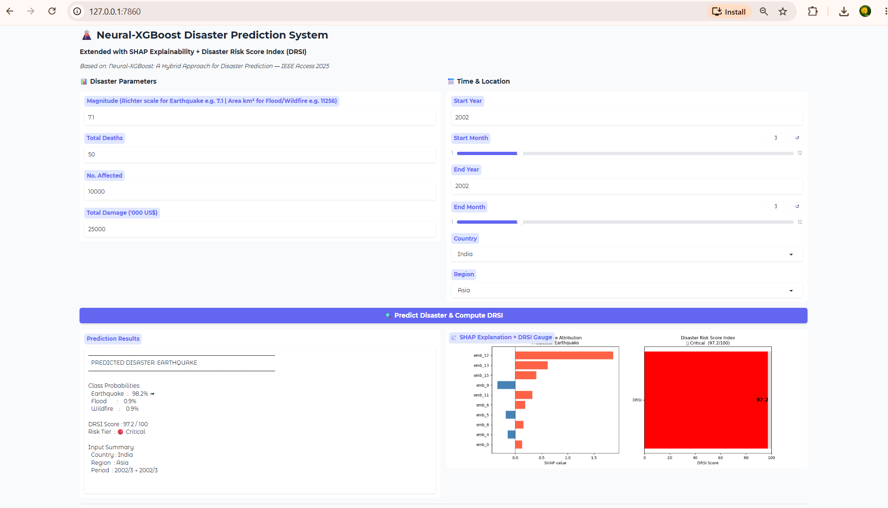
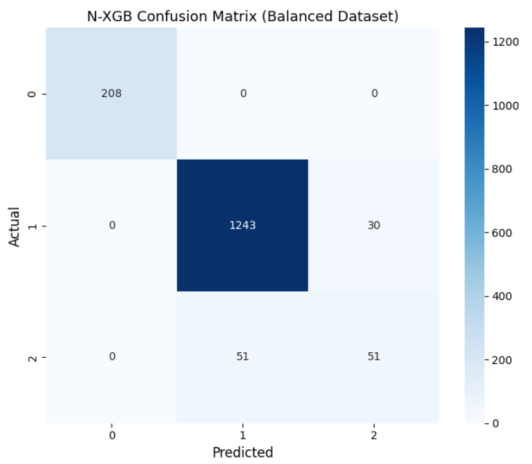
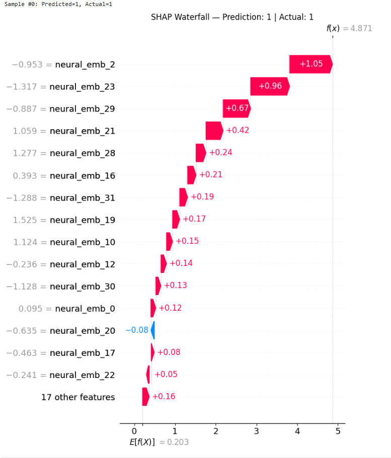
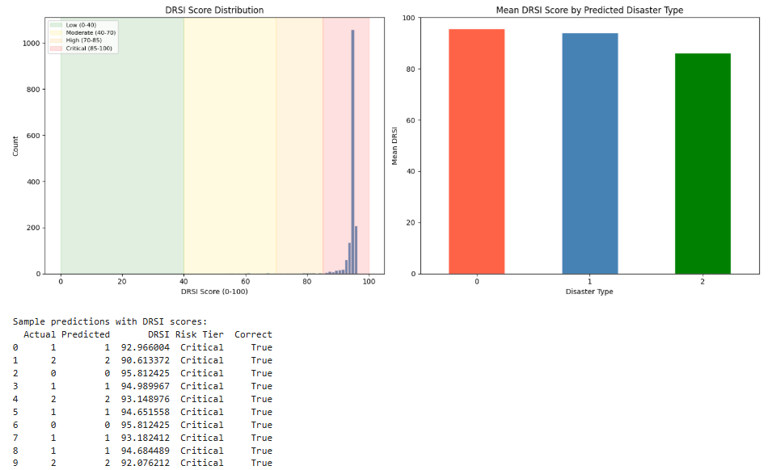

# 🌍 Neural-XGBoost Disaster Prediction

A hybrid machine learning system that predicts **disaster types** using a combination of **Neural Network feature learning and XGBoost classification**.

The project also integrates **SMOTE for class balancing**, **SHAP for model explainability**, a **Disaster Risk Score Index (DRSI)**, and an interactive **Gradio dashboard** for real-time predictions.

---

## 📌 Project Overview

Disaster events can vary significantly in their characteristics, severity, and impact. Machine learning can be used to analyze historical disaster data and identify patterns that help classify disaster types.

In this project, historical disaster-event data from the **EM-DAT (Emergency Events Database)** is processed and used to develop a three-class disaster classification system.

The proposed model, called **Neural-XGBoost (N-XGB)**, combines:

1. Data preprocessing
2. Feature encoding and scaling
3. SMOTE-based class balancing
4. Neural Network feature learning
5. XGBoost classification
6. SHAP explainability
7. Disaster Risk Score Index (DRSI)
8. Gradio interactive prediction interface

---

# 🎯 Objectives

The main objectives of this project are:

- To preprocess historical disaster-event data.
- To handle missing values in the dataset.
- To remove features that may cause target leakage.
- To encode categorical features.
- To balance the training data using SMOTE.
- To learn feature representations using a Neural Network.
- To classify disaster types using XGBoost.
- To compare the proposed approach with traditional machine learning models.
- To explain predictions using SHAP.
- To calculate a Disaster Risk Score Index (DRSI).
- To provide an interactive prediction dashboard using Gradio.

---

# 🌪️ Disaster Classes

The project focuses on three disaster categories:

| Class | Description |
|---|---|
| Flood | Flood-related disaster events |
| Earthquake | Earthquake-related disaster events |
| Wildfire | Wildfire-related disaster events |

The original EM-DAT dataset contains additional disaster categories. The project filters the data to these three classes for the proposed classification task.

---

# 📊 Dataset

The dataset used in this project is obtained from the **EM-DAT (Emergency Events Database)**.

**Source:**  
Centre for Research on the Epidemiology of Disasters (CRED), Université catholique de Louvain (UCLouvain).

The original dataset contains:

- **9,730 records**
- **47 columns**

The dataset contains information related to disaster events, including:

- Disaster type
- Country
- Region
- Magnitude
- Number of deaths
- Number affected
- Total damage
- Start and end year
- Start and end month
- Disaster classification information
- Geographic and administrative information
- Other disaster-related attributes

### Dataset Processing

The project performs the following processing steps:

```text
Original EM-DAT Dataset
        ↓
Filter Disaster Types
        ↓
Flood / Earthquake / Wildfire
        ↓
Remove High-Missing Columns
        ↓
Remove Leakage Columns
        ↓
Encode Target
        ↓
Select Features
        ↓
Encode Categorical Features
        ↓
Train-Test Split
        ↓
Missing Value Imputation
        ↓
Feature Scaling
        ↓
SMOTE
```

### Selected Features

The final model uses the following 10 features:

```text
1. Magnitude
2. Total Deaths
3. No. Affected
4. Total Damage ('000 US$)
5. Start Year
6. Start Month
7. End Year
8. End Month
9. Country
10. Region
```

### Target Variable

The target variable is:

```text
Disaster Type
```

The target is encoded into numerical classes for machine learning.

---

# ⚙️ Data Preprocessing

Several preprocessing operations are performed before model training.

### Missing Value Handling

Columns containing more than **80% missing values** are removed.

For the remaining missing values, **median imputation** is applied to the model features.

### Leakage Removal

The following columns are removed because they contain information that could directly reveal the disaster classification:

```text
Classification Key
Disaster Group
Disaster Subgroup
Disaster Subtype
```

### Categorical Encoding

Categorical features such as:

```text
Country
Region
```

are converted into numerical representations using `LabelEncoder`.

### Feature Scaling

The numerical feature values are standardized using:

```text
StandardScaler
```

---

# ⚖️ Handling Class Imbalance

The disaster classes are not equally represented in the original dataset.

To reduce the effect of class imbalance, **SMOTE (Synthetic Minority Over-sampling Technique)** is applied only to the training data.

```text
Training Data
     ↓
SMOTE
     ↓
Balanced Training Data
```

The test dataset remains unchanged so that model evaluation represents unseen real-world data more realistically.

---

# 🧠 Neural Network Feature Learning

A custom PyTorch neural network named **DisasterNet** is used to learn feature representations.

The architecture includes:

```text
Input Features
      ↓
Fully Connected Layer (128)
      ↓
Batch Normalization
      ↓
ReLU + Dropout
      ↓
Fully Connected Layer (64)
      ↓
Batch Normalization
      ↓
ReLU + Dropout
      ↓
Fully Connected Layer (32)
      ↓
Batch Normalization
      ↓
ReLU + Dropout
      ↓
Embedding Layer (16)
      ↓
Learned Neural Embeddings
```

The neural network generates a **16-dimensional embedding representation** of the input features.

These learned embeddings are then passed to XGBoost.

---

# 🚀 Neural-XGBoost (N-XGB)

The proposed model combines the strengths of:

### Neural Network

Used for:

- Learning nonlinear feature representations
- Extracting useful latent features
- Producing 16-dimensional embeddings

### XGBoost

Used for:

- Final multi-class classification
- Learning complex decision boundaries
- Producing class probabilities

The complete approach is:

```text
Original Features
       ↓
Preprocessing
       ↓
SMOTE
       ↓
Neural Network
       ↓
16-Dimensional Embeddings
       ↓
XGBoost
       ↓
Disaster Prediction
```

---

# 🤖 Baseline Models

To evaluate the proposed approach, the project also implements traditional machine learning models:

- Logistic Regression
- Random Forest
- Support Vector Machine (SVM)
- K-Nearest Neighbors (KNN)

Their results are compared with the proposed Neural-XGBoost model.

---

# 📈 Model Evaluation

The models are evaluated using:

- Accuracy
- Weighted F1-score
- Macro F1-score
- Precision
- Recall
- Confusion Matrix

The notebook contains the complete experimental results and visualizations.

---

# 🔍 SHAP Explainability

Machine learning models can sometimes behave like black boxes.

To improve interpretability, this project uses **SHAP (SHapley Additive exPlanations)**.

SHAP is used to analyze how the learned neural-network embeddings contribute to predictions made by the XGBoost model.

The project includes:

- SHAP global feature attribution
- SHAP beeswarm visualization
- SHAP waterfall visualization
- Per-prediction feature contribution

The neural embeddings are represented as:

```text
neural_emb_0
neural_emb_1
...
neural_emb_15
```

This allows the contribution of the learned representations to be analyzed.

---

# ⚠️ Disaster Risk Score Index (DRSI)

In addition to predicting the disaster class, the project calculates a **Disaster Risk Score Index (DRSI)**.

The DRSI is calculated using a combination of:

- Maximum prediction probability
- SHAP-based contribution
- Prediction confidence

The resulting score is normalized to a:

```text
0 – 100
```

scale.

### Risk Categories

| DRSI Score | Risk Level |
|---:|---|
| 0–39 | Low |
| 40–69 | Moderate |
| 70–84 | High |
| 85–100 | Critical |

The DRSI provides an additional interpretation of the prediction and is not intended to replace professional disaster-risk assessment.

---

# 🖥️ Gradio Application

The project includes an interactive **Gradio** interface.

Users can enter disaster-related parameters and obtain:

- Predicted disaster type
- Prediction probabilities
- DRSI score
- Risk tier
- SHAP-based explanation

### Application Screenshot



---

# 📊 N-XGB Confusion Matrix

The following visualization shows the classification performance of the proposed Neural-XGBoost model.



---

# 🔎 SHAP Explanation

The project provides SHAP-based explanations for individual predictions.



---

# 📉 DRSI Analysis

The project also visualizes the calculated Disaster Risk Score Index.



---

# 🛠️ Technologies Used

| Technology | Purpose |
|---|---|
| Python | Core programming language |
| Pandas | Data processing |
| NumPy | Numerical computation |
| Scikit-learn | Preprocessing and baseline models |
| PyTorch | Neural Network feature learning |
| XGBoost | Final classification |
| imbalanced-learn | SMOTE class balancing |
| SHAP | Model explainability |
| Gradio | Interactive user interface |
| Matplotlib | Visualization |
| Seaborn | Statistical visualization |
| SciPy | Entropy calculation for DRSI |
| Joblib | Model-related utilities |
| Jupyter Notebook | Experimentation and analysis |

---

# 📁 Project Structure

```text
Neural-XGBoost-Disaster-Prediction/
│
├── README.md
├── requirements.txt
├── .gitignore
│
├── src/
│   └── disaster_pred.py
│
├── notebooks/
│   └── Disaster_Prediction_Using_Neural_XGBoost.ipynb
│
├── data/
│   └── README.md
│
├── docs/
│   └── Mini_Project_Final.pptx
│
└── assets/
    └── screenshots/
        ├── gradio-interface.png
        ├── nxgb-confusion-matrix.png
        ├── shap-waterfall.png
        └── drsi-analysis.png
```

---

# ⚙️ Installation

## 1. Clone the Repository

```bash
git clone https://github.com/YOUR-USERNAME/Neural-XGBoost-Disaster-Prediction.git
```

```bash
cd Neural-XGBoost-Disaster-Prediction
```

## 2. Create a Virtual Environment

### Windows

```bash
python -m venv venv
```

```bash
venv\Scripts\activate
```

### macOS/Linux

```bash
python3 -m venv venv
```

```bash
source venv/bin/activate
```

## 3. Install Dependencies

```bash
pip install -r requirements.txt
```

---

# ▶️ Running the Project

## Python Application

Run:

```bash
python src/disaster_pred.py
```

## Jupyter Notebook

Open:

```text
notebooks/Disaster_Prediction_Using_Neural_XGBoost.ipynb
```

Run the notebook cells sequentially to reproduce the data preprocessing, model training, evaluation, SHAP analysis, and DRSI calculations.

---

# 📚 Dataset Access

The original dataset used for this project was obtained from **EM-DAT — The International Disaster Database**.

The raw EM-DAT dataset is not included in this public GitHub repository.

Please obtain the dataset through the official EM-DAT data portal and follow the applicable EM-DAT terms of use.

The `data/README.md` file provides additional information about the dataset source and how it should be obtained.

---

# 🔮 Future Improvements

Possible future improvements include:

- Integration of real-time environmental data
- Additional disaster categories
- Larger and more recent datasets
- Hyperparameter optimization
- Model deployment to a cloud platform
- Real-time disaster monitoring
- Automated model retraining
- Model versioning
- Automated testing
- CI/CD pipeline
- Dedicated web dashboard

---

# ⚠️ Disclaimer

This project is developed for **academic and portfolio purposes**.

The predictions and DRSI scores generated by this system should not be used as the sole basis for real-world emergency management, disaster response, or safety decisions.

---

# 👩‍💻 Author

**Saismiruthi**

GitHub: `https://github.com/Saismiruthi`